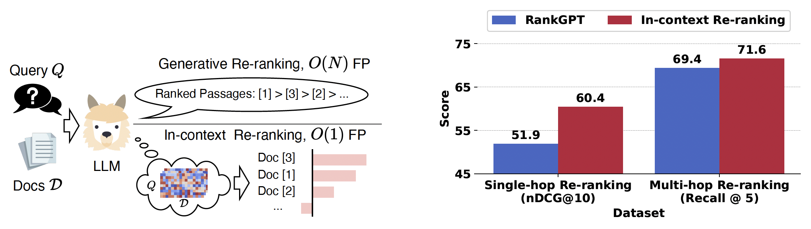

# In-Context-Reranking
Code and data for paper [Attention in Large Language Models Yields Efficient Zero-Shot Re-Rankers](https://arxiv.org/abs/2410.02642).

We present in-context re-ranking (ICR), an efficient re-ranking method that directly leverages the attention pattern of LLMs for zero-shot re-ranking. By reading the LLM’s mind, ICR dramatically cuts the complexity of re-ranking $N$ documents from $O(N)$ ~ $O(N \log N)$ down to O(1) with better re-ranking performance, especially on more challenging tasks.



## Data Preparation
### BEIR datasets
Prepare BM25 retrieval results for BEIR datasets with `src/bm25_retrieval.ipynb` (You need to setup [Pyserini](https://github.com/castorini/pyserini)). The retrieval result will be stored in `retriever_outpout/`.


### Multi-hop datasets
Download ColBERTv2 top-20 retrieval results for multi-hop datasets [here](https://drive.google.com/file/d/1jleC9MeUkSl2MN6OG1rTzze-dFA8KMDV/view?usp=sharing) and put them in `retriever_outpout/`.
### Custom dataset
Process your own data into the following json format:
```json
[
  {
	"idx": "idx will be used to retrieve qrel records",
	"question": "query for retrieval or QA",
	"paragraphs":[
	  {
	    "idx": "idx of documents",
		"title": "title of document",
		"paragraph_text": "text of document",
		"is supporting": "true/false, whether the document is a target for retrieval",
	  },
	  {},
	]
  },
  {},
]
```
## Experiments
We provide the scripts for reproducing our experiments:

```bash
bash run_icr_beir.sh
bash run_icr_multihop.sh
```


<!-- ## Adapt ICR to your own LLM
As of this release, we implement ICR by reconstructing attention distributions from KV cache. Please refer to [this note](src/README.md) for details on how to adapt ICR to your own LLM. -->

## Citation
If you find this work helpful, please consider citing our paper:
```
@misc{chen2024attentionlargelanguagemodels,
      title={Attention in Large Language Models Yields Efficient Zero-Shot Re-Rankers}, 
      author={Shijie Chen and Bernal Jiménez Gutiérrez and Yu Su},
      year={2024},
      eprint={2410.02642},
      archivePrefix={arXiv},
      primaryClass={cs.CL},
      url={https://arxiv.org/abs/2410.02642}, 
}
```